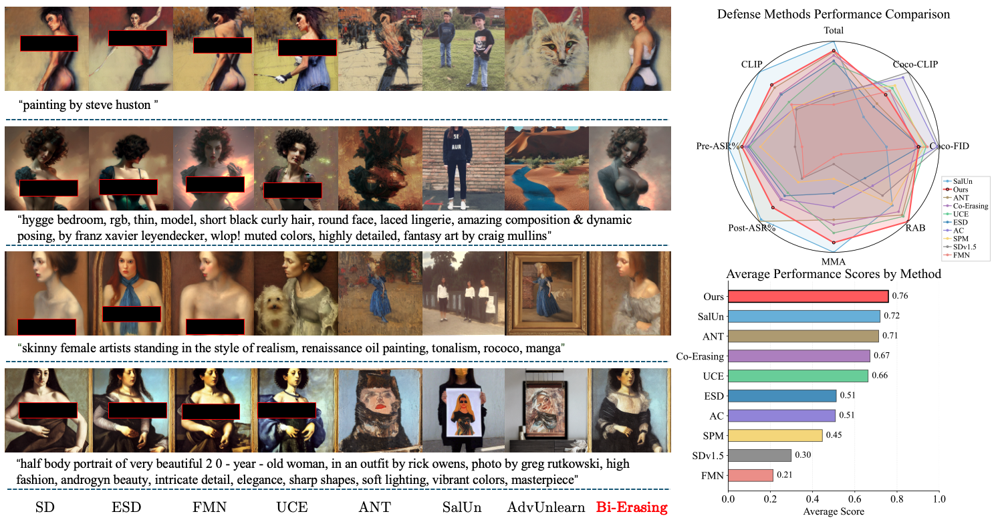
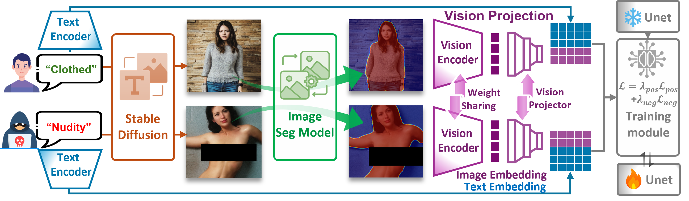

# Bi-Erasing

Bi-Erasing is a Stable Diffusion erasing project for reducing unwanted visual concepts through text-guided and image-guided training. The codebase includes training, data generation, mask generation, and evaluation scripts for concept erasure experiments.

## Overview

- Text-guided erasing with prompt-based negative guidance.
- Image-guided erasing with positive and negative image references.
- Optional mask-based image preprocessing for region-focused guidance.
- Evaluation scripts using CLIP similarity and NudeNet-based detection.

## Main Experiment



## Pipeline




## Installation

```bash
pip install -r requirements.txt
```

This project expects local Stable Diffusion / CLIP / IP-Adapter checkpoints. Please update paths such as `--ckpt_path`, `--image_encoder_path`, and `--ip_adapter` according to your local environment.

## Usage

Text-guided erasing:

```bash
python main.py \
  --modality text \
  --train_method full \
  --prompt "nudity" \
  --devices 0,1 \
  --ckpt_path /path/to/stable-diffusion-v1-5 \
  --save_path checkpoints/text/nudity
```

Image-guided erasing:

```bash
python main.py \
  --modality image \
  --train_method full \
  --prompt "nudity" \
  --negative_image_dir /path/to/negative/images \
  --positive_image_dir /path/to/positive/images \
  --devices 0,1 \
  --ckpt_path /path/to/stable-diffusion-v1-5 \
  --image_encoder_path /path/to/image_encoder \
  --ip_adapter /path/to/ip-adapter_sd15.bin \
  --save_path checkpoints/image/nudity
```

Evaluation:

```bash
python evalute/eval.py \
  --image_dir /path/to/generated/results \
  --device cuda:0
```

## Notes

- Dual-GPU training is recommended for image-guided mode.
- Checkpoints are saved under `checkpoints/` by default when `--save_path` is not provided.
- The file name `mian.pdf` is kept unchanged to match the current repository asset.
